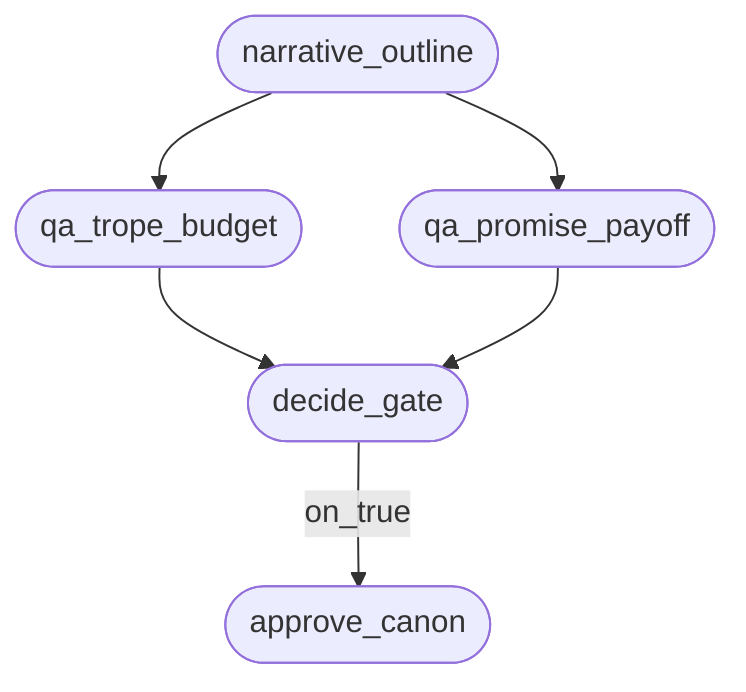

```mermaid
flowchart TD
    narrative_outline([narrative_outline])
    qa_trope_budget([qa_trope_budget])
    qa_promise_payoff([qa_promise_payoff])
    decide_gate([decide_gate])
    approve_canon([approve_canon])
    narrative_outline --> qa_trope_budget
    narrative_outline --> qa_promise_payoff
    qa_trope_budget --> decide_gate
    qa_promise_payoff --> decide_gate
    decide_gate -- on_true --> approve_canon
```
