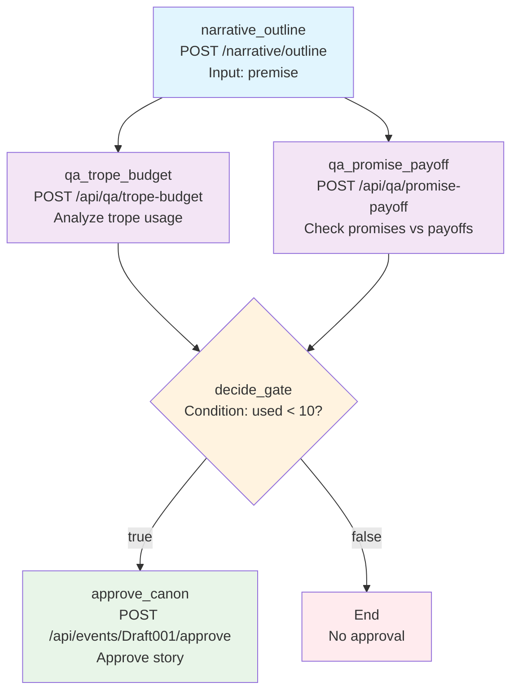

# StoryMaker Outline Graph Visualization

## Mermaid Diagram

## Graph Flow Description

1. **narrative_outline** (Entry Point - Blue)
   - Takes user premise as input
   - Generates story outline with beats
   - Calls Narrative service

2. **qa_trope_budget** (Purple - Parallel)
   - Analyzes trope usage in the generated outline
   - Calls WorldCore QA service

3. **qa_promise_payoff** (Purple - Parallel)
   - Checks story promises vs payoffs
   - Calls WorldCore QA service

4. **decide_gate** (Orange - Conditional)
   - Evaluates if trope usage < 10
   - Branches based on condition

5. **approve_canon** (Green - Conditional)
   - Only runs if condition is true
   - Approves the story for canon

6. **End** (Red - Terminal)
   - Reached if condition is false
   - Story not approved

## Environment Variables Required
- `NARRATIVE_BASE`: Base URL for narrative service
- `WORLDCORE_BASE`: Base URL for worldcore service

## Generated File Location
`services/orchestration/generated/outline_graph.py`
